# Opareta

A microservices-based payment platform built with NestJS and NX monorepo architecture.

## Table of Contents

- [Overview](#overview)
- [Architecture](#architecture)
  - [System Context (C4 Level 1)](#system-context-c4-level-1)
  - [Container Diagram (C4 Level 2)](#container-diagram-c4-level-2)
  - [Component Diagram (C4 Level 3)](#component-diagram-c4-level-3)
  - [Code Diagram (C4 Level 4)](#code-diagram-c4-level-4)
- [Flows](#flows)
  - [User Registration Flow](#user-registration-flow)
  - [Authentication Flow](#authentication-flow)
  - [Payment Creation Flow](#payment-creation-flow)
  - [Webhook Processing Flow](#webhook-processing-flow)
- [Technical Decisions](#technical-decisions)
- [Project Structure](#project-structure)
- [Getting Started](#getting-started)
  - [Prerequisites](#prerequisites)
  - [Local Development](#local-development)
  - [Docker Development](#docker-development)
- [Running Tests](#running-tests)
- [API Documentation](#api-documentation)

## Overview

Opareta is a payment processing platform consisting of two core microservices:

- **Argus** - Authentication service handling user registration, login, and JWT token management
- **Hermes** - Payment service managing payment initiation, status tracking, and provider webhooks

## Architecture

> **Note:** Diagram images are available in [`docs/diagrams/`](docs/diagrams/). GitHub renders Mermaid diagrams inline below.

### System Context (C4 Level 1)


<details>
<summary>View Mermaid source</summary>


</details>

### Container Diagram (C4 Level 2)


<details>
<summary>View Mermaid source</summary>


</details>

### Component Diagram (C4 Level 3)

#### Argus (Authentication Service)


<details>
<summary>View Mermaid source</summary>


</details>

#### Hermes (Payment Service)


<details>
<summary>View Mermaid source</summary>


</details>

### Code Diagram (C4 Level 4)

#### Argus - Auth Module Classes

```mermaid
classDiagram
    class AuthController {
        -authService: AuthService
        +register(dto: CreateUserDto): Promise~UserResponseDto~
        +login(dto: LoginDto): Promise~TokenResponseDto~
    }

    class AuthService {
        -usersService: UsersService
        -jwtKeyService: JwtKeyService
        -tokenCacheService: TokenCacheService
        +register(dto: CreateUserDto): Promise~UserResponseDto~
        +login(dto: LoginDto): Promise~TokenResponseDto~
        -validateUser(phone: string, password: string): Promise~User~
        -generateToken(user: User): Promise~string~
    }

    class UsersService {
        -usersRepository: Repository~User~
        +register(dto: CreateUserDto): Promise~UserResponseDto~
        +findByPhoneNumber(phone: string): Promise~User~
        +findById(id: string): Promise~User~
        +toResponse(user: User): UserResponseDto
    }

    class JwtKeyService {
        -privateKey: KeyObject
        -publicKey: KeyObject
        -keyId: string
        +onModuleInit(): Promise~void~
        +signToken(payload: JwtPayload): string
        +getJwks(): JwksResponse
        -loadOrGenerateKeys(): Promise~void~
    }

    class User {
        +id: string
        +phone_number: string
        +email: string
        +password: string
        +created_at: Date
        +updated_at: Date
    }

    class CreateUserDto {
        +phone_number: string
        +email: string
        +password: string
    }

    class LoginDto {
        +phone_number: string
        +password: string
    }

    class UserResponseDto {
        +id: string
        +phone_number: string
        +email: string
        +created_at: string
    }

    AuthController --> AuthService : uses
    AuthService --> UsersService : uses
    AuthService --> JwtKeyService : uses
    UsersService --> User : manages
    AuthController ..> CreateUserDto : accepts
    AuthController ..> LoginDto : accepts
    AuthController ..> UserResponseDto : returns
```


<details>
<summary>View Mermaid source</summary>


</details>

#### Hermes - Payments Module Classes


<details>
<summary>View Mermaid source</summary>


</details>

#### Common Library - Shared Classes


<details>
<summary>View Mermaid source</summary>


</details>

#### Payment State Machine


<details>
<summary>View Mermaid source</summary>


</details>

## Flows

### User Registration Flow


<details>
<summary>View Mermaid source</summary>


</details>

### Authentication Flow


<details>
<summary>View Mermaid source</summary>


</details>

### Payment Creation Flow


<details>
<summary>View Mermaid source</summary>


</details>

### Webhook Processing Flow


<details>
<summary>View Mermaid source</summary>


</details>

### JWT Validation Flow (JWKS)


<details>
<summary>View Mermaid source</summary>


</details>

## Technical Decisions

### NX Monorepo

We chose NX for several reasons:

- **Shared Code** - Common libraries (`@opareta/common`, `@opareta/dummy-provider`) are easily shared between services
- **Consistent Tooling** - Unified build, test, and lint configurations across all projects
- **Dependency Graph** - NX understands project dependencies and builds in the correct order
- **Affected Commands** - Only rebuild/retest what changed, dramatically speeding up CI
- **Caching** - Local and remote caching of build artifacts

### JWKS (JSON Web Key Set) for Authentication

Instead of sharing JWT secrets between services, we use JWKS:

- **Decoupled Services** - Hermes doesn't need Argus's private key; it only needs the public JWKS endpoint
- **Key Rotation** - Keys can be rotated without redeploying all services
- **Industry Standard** - OpenID Connect compatible, works with standard libraries
- **Zero Trust** - Services verify tokens independently without trusting shared secrets

**Flow:**
1. Argus generates RSA key pair on startup (or loads from disk)
2. Argus exposes `/.well-known/jwks.json` with the public key
3. Argus signs JWTs with the private key
4. Hermes fetches JWKS from Argus and validates tokens using the public key

### Database Per Service

Each service has its own PostgreSQL database:

- **Data Isolation** - Services can't accidentally access each other's data
- **Independent Scaling** - Databases can be scaled independently
- **Schema Freedom** - Each service controls its own schema evolution
- **Failure Isolation** - One database going down doesn't affect other services

### Shared Libraries

| Library | Purpose |
|---------|---------|
| `@opareta/common` | Guards, decorators, filters, logging, Redis caching |
| `@opareta/dummy-provider` | Mock payment provider for development/testing |

## Project Structure

```
opareta/
├── apps/
│   ├── argus/                 # Authentication service
│   │   └── src/
│   │       └── app/
│   │           ├── auth/      # Login, JWT signing
│   │           ├── users/     # User registration, management
│   │           └── database/  # TypeORM configuration
│   │
│   └── hermes/                # Payment service
│       └── src/
│           └── app/
│               ├── payments/  # Payment CRUD, status management
│               ├── webhooks/  # Provider webhook handling
│               └── database/  # TypeORM configuration
│
├── libs/
│   ├── common/                # Shared utilities
│   │   └── src/lib/
│   │       ├── guards/        # JwksAuthGuard
│   │       ├── cache/         # TokenCacheService, RedisCacheModule
│   │       ├── decorators/    # @CurrentUser()
│   │       ├── filters/       # HttpExceptionFilter
│   │       ├── logger/        # Winston logging
│   │       └── middleware/    # HTTP request logging
│   │
│   └── dummy-provider/        # Mock payment provider
│
├── docker-compose.yml         # Full stack with databases
├── Dockerfile                 # Multi-stage production build
└── Dockerfile.test            # Test runner image
```

## Getting Started

### Prerequisites

- Node.js 22+
- Docker and Docker Compose
- npm 10+

### Local Development

1. **Install dependencies:**
   ```bash
   npm install
   ```

2. **Start infrastructure (databases, Redis):**
   ```bash
   docker compose up -d postgres-argus postgres-hermes redis
   ```

3. **Run services in development mode:**
   ```bash
   # Terminal 1 - Auth service
   npx nx serve argus

   # Terminal 2 - Payment service
   npx nx serve hermes
   ```

4. **Access services:**
   - Argus (Auth): http://localhost:3000/api
   - Hermes (Payments): http://localhost:3001/api
   - Swagger Docs: http://localhost:3000/api/docs, http://localhost:3001/api/docs

### Docker Development

Run the complete stack with Docker Compose:

```bash
# Build and start all services
docker compose up --build

# Or run in detached mode
docker compose up -d --build

# View logs
docker compose logs -f

# Stop all services
docker compose down
```

**Services:**

| Service | Port | Description |
|---------|------|-------------|
| argus | 3000 | Authentication API |
| hermes | 3001 | Payments API |
| postgres-argus | 5432 | Argus database |
| postgres-hermes | 5433 | Hermes database |
| redis | 6379 | Token cache |

### Environment Variables

Create `.env` files or set these variables:

**Argus:**
```env
PORT=3000
DB_HOST=localhost
DB_PORT=5432
DB_USERNAME=argus
DB_PASSWORD=argus_secret
DB_NAME=argus_db
REDIS_HOST=localhost
REDIS_PORT=6379
JWT_EXPIRATION_SECONDS=7200
```

**Hermes:**
```env
PORT=3001
DB_HOST=localhost
DB_PORT=5433
DB_USERNAME=hermes
DB_PASSWORD=hermes_secret
DB_NAME=hermes_db
REDIS_HOST=localhost
REDIS_PORT=6379
JWKS_URI=http://localhost:3000/api/.well-known/jwks.json
```

## Running Tests

### Local Testing

```bash
# Run all tests
npx nx run-many -t test

# Run tests for a specific project
npx nx test @opareta/argus
npx nx test @opareta/hermes
npx nx test common

# Run tests with coverage
npx nx test @opareta/argus --coverage

# Run in watch mode
npx nx test @opareta/argus --watch
```

### Docker Testing

```bash
# Run all tests in Docker
docker compose --profile test run --rm --build test

# Run tests for a specific project
docker compose --profile test run --rm test-project argus
docker compose --profile test run --rm test-project hermes
```

### Test Coverage

| Project | Tests |
|---------|-------|
| common | 11 |
| argus | 18 |
| hermes | 42 |
| **Total** | **71** |

## API Documentation

Both services expose Swagger documentation:

- **Argus:** http://localhost:3000/api/docs
- **Hermes:** http://localhost:3001/api/docs

### Key Endpoints

**Argus (Authentication):**
- `POST /api/auth/register` - Register new user
- `POST /api/auth/login` - Login and get JWT
- `GET /api/.well-known/jwks.json` - Public JWKS endpoint
- `GET /api/users/me` - Get current user (authenticated)

**Hermes (Payments):**
- `POST /api/payments` - Create payment (authenticated)
- `GET /api/payments/:reference` - Get payment status (authenticated)
- `POST /api/webhooks/payment` - Payment provider webhook

## License

Private - All rights reserved.
